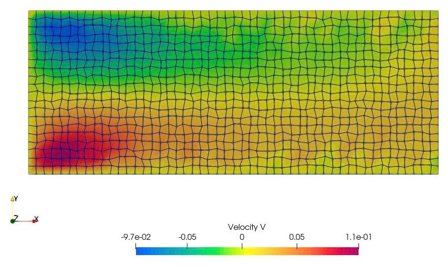

Unstructured solver for compressible flow. There are 4 cases are covered in this code, including:

(0) Lid-driven cavity flow.
(1) Flow through airfoil.
(2) Channel flow (Poiseuille flow)
(3) Heat conduction.

Mesh Generator:
    - Delauney method for channel flow.

Numerical scheme:
  - RK4 and Euler for time advection.
  - Reconstruction scheme for primitive variables: 1st order.
  - Convective scheme: ROE's and original AUSM schemes. 
  - 2nd order scheme for diffusion terms.

Result:
(2) Chanel flow.

